# YBIGTA_newbie_team_project

## 팀 소개
안녕하세요 YBIGTA 신입기수 세션 6조입니다.

## 팀원 자기소개
- **권준범**: 응용정보공학과 23학번, 04년생
- **나예린**: 도시공학과 24학번, 05년생
- **박형민**: 문헌정보학과, 26학번, 01년생

## GitHub 협업 과정 (4회차)

### Branch Protection Rule 적용
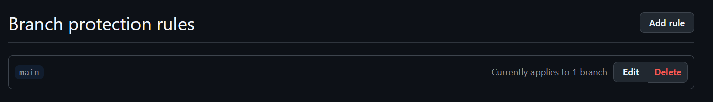

### Main 브랜치 Push 거부 확인
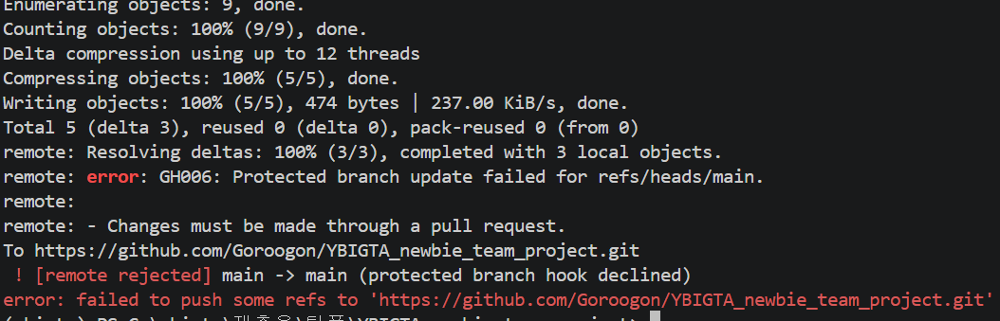

### PR + Review + Merge
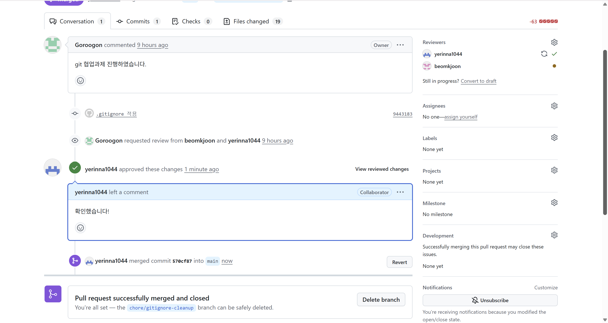

## 과제 실행 방법

### 1. Web
FastAPI와 MVC 패턴을 기반으로 사용자 로그인 기능 구현

- **index.html 꾸미기**: 다크모드 스타일링 등 시각적 요소 추가
- **user_service.py**: 로그인, 회원가입, 삭제, 비밀번호 변경에 대한 비즈니스 로직과 예외 처리 구현
- **user_router.py**: 아래 4개 API 엔드포인트 구현
  - `POST /api/user/login` - 로그인
  - `POST /api/user/register` - 회원가입
  - `DELETE /api/user/delete` - 회원 삭제
  - `PUT /api/user/update-password` - 비밀번호 변경

### 2. 크롤링
<왕과 사는 남자> 영화에 대해 세 개 사이트에서 리뷰 데이터 수집

- **메가박스**: 별점(10점 만점), 작성일, 리뷰 내용 510개 수집, `database/reviews_megabox.csv`에 저장
- **Kinolights**: 별점(5점 만점), 작성일, 리뷰 내용 505개 수집, `database/reviews_kinolights.csv`에 저장
- **네이버 영화 관람평**: 별점(5점 만점), 작성일, 리뷰 내용 500개 수집, `database/reviews_naver.csv`에 저장
- 리뷰 내용이 비어있는 관람평은 최소조건(별점/날짜/내용 모두 포함) 충족을 위해 수집에서 제외

### 3. EDA·FE
크롤링한 세 사이트의 리뷰 데이터를 대상으로 개별 분석과 사이트간 비교분석 진행

- **EDA**: 별점, 텍스트 길이, 날짜의 분포와 이상치 파악
- **데이터 전처리/FE**: 사이트별 별점·날짜 형식 통일, 결측치·이상치 제거, 텍스트 전처리 진행, 파생변수로 요일 추출, TF-IDF 평균 점수 두 가지 생성
- **비교분석**: 감성분석, 키워드 분석, 시계열 분석을 통해 사이트간 차이 비교

---

# [3회차] 크롤링 과제 - &lt;왕과 사는 남자&gt; 리뷰 수집

## 데이터 소개

### 메가박스 (나예린)

- **사이트 링크**: https://www.megabox.co.kr/movie-detail/comment?rpstMovieNo=25104500
- **데이터 형식**: `rating`(별점, 10점 만점), `date`(작성일, YYYY-MM-DD), `content`(리뷰 내용)
- **수집 개수**: 510개
- **저장 위치**: `database/reviews_megabox.csv`
- **비고**: 리뷰 내용이 비어있는 관람평(별점만 남긴 경우)은 최소조건(별점/날짜/내용 모두 포함)을 만족시키기 위해 수집에서 제외했습니다.

### Kinolights (권준범)

- **사이트 링크**: https://m.kinolights.com/season/148606/reviews
- **데이터 형식**: `rating`(별점, 5점 만점), `date`(작성일, YYYY-MM-DD), `content`(리뷰 내용)
- **수집 개수**: 505개
- **저장 위치**: `database/reviews_kinolights`
- **비고**: 리뷰 내용이 비어있는 관람평(별점만 남긴 경우)은 최소조건(별점/날짜/내용 모두 포함)을 만족시키기 위해 수집에서 제외했습니다.


### 네이버 영화 관람평 (박형민)

- **사이트 링크**: https://search.naver.com/search.naver?where=nexearch&sm=tab_etc&mra=bkEw&pkid=68&os=35442190&qvt=0&query=%EC%99%95%EA%B3%BC%20%EC%82%AC%EB%8A%94%20%EB%82%A8%EC%9E%90%20%EA%B4%80%EB%9E%8C%ED%8F%89
- **데이터 형식**: `rating`(별점, 5점 만점), `date`(작성일, YYYY-MM-DD HH:MM:SS AM/PM), `content`(리뷰 내용)
- **수집 개수**: 500
- **저장 위치**: `database/reviews_naver.csv`

## 실행 방법

### 0. 필요한 패키지 설치

```bash
pip install beautifulsoup4 selenium pandas scikit-learn kiwipiepy matplotlib seaborn --break-system-packages
```

### 1. 전체 크롤러 한 번에 실행

프로젝트 루트(`README.md`가 있는 위치)에서 아래 명령어 실행 시,
`CRAWLER_CLASSES`에 등록된 모든 크롤러가 순서대로 실행되어
각자의 결과 CSV가 지정한 output_path에 저장됨

```bash
python -m review_analysis.crawling.main -o {output_path} --all
```

예시:

```bash
python -m review_analysis.crawling.main -o database --all
```

### 2. 특정 크롤러 하나만 실행

```bash
python -m review_analysis.crawling.main -o database --crawler megabox
```

예시 (메가박스만 실행):

```bash
python -m review_analysis.crawling.main -o {output_path} --crawler {크롤러 이름}
```

`{크롤러 이름}`에는 `review_analysis/crawling/main.py`의 `CRAWLER_CLASSES` 딕셔너리에 
등록된 이름(`kinolights`, `megabox` 등) 사용

### 3. 브라우저 창 실행 안내

Selenium이 Edge, Chrome 브라우저를 직접 실행하여 크롤링 진행
실행 중 브라우저 창 유지 필수(임의 종료 금지)
크롤링 종료 시 브라우저 자동 종료

---

# [4회차] EDA&FE, 시각화 과제 - &lt;왕과 사는 남자&gt; 리뷰 분석

## 1. EDA

### 이상치와 결측치

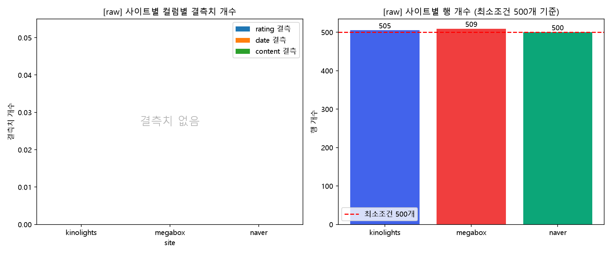
사이트 별 행 개수와 결측치

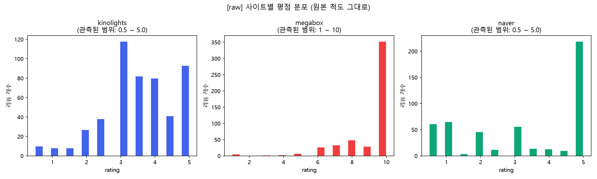
사이트 별 평점 분포(이상치 탐색)


각 사이트가 조건에 맡게 500개 이상씩 리뷰가 잘 수집된 것으로 보인다. 또한 수집한 평점, 날짜, 리뷰 내용도 수집과정에서 결측값 없이 잘 수정된 것으로 보인다. 날짜의 경우 YYYY-MM-DD로 수집되었고 naver의 경우는 시간까지 수집되었다(HH:MM:SS AM/PM). 리뷰 내용도 이상치로 볼 수 있는 내용은 없었다. 평점의 경우 확인해볼 점은 평점의 척도였다. megabox의 경우 평점이 10점 만점이지만, naver와 kinolights는 5점 만점으로 수집되었다(naver의 평점 척도도 실은 10점 만점이었으나 수집과정에서 가장 평균적인 5점 척도로 환산하여 저장함). 결과적으로 처리해야할 결측값은 보이지 않으며, naver의 날짜 형식과 megabox의 평점 척도는 전처리가 필요할 것으로 보인다.

## 2. 전처리/FE

전처리 실행코드: python -m review_analysis.preprocessing.main -o database --all

전처리/FE를 진행하였다. 수집한 새 개의 사이트 모두 평점, 날짜, 리뷰 내용을 수집하였고 형식 상 큰 차이를 보이지 않아 팀원들과 상의 후 하나의 전처리 코드로 3개의 크롤링 데이터 전처리를 진행하였다.
먼저  EDA 과정에서 발견된 naver의 날짜 형식과 megabox의 평점 척도에 대해 전처리를 진행하였다. 날짜 형식은 시간을 제외한 YYYY-MM-DD 형식으로 통일하였고 평점 척도 또한 다른 사이트와 동일하게 5점 척도로 변환하였다. 추가적으로 리뷰 내용에 대해 텍스트 데이터 전처리를 진행하였다. 전처리는 java 등 다른 것이 별도로 필요없는 kiwipiepy를 활용해 형태소 분석을 진행하였다. kiwipiepy를 통해 리뷰 내용을 형태소 단위로 분해하고 코드에서 정의한 간단한 stopword 목록을 이용해 불용어를 제거하여 cleaned_review라는 컬럼에 텍스트 데이터 전처리 결과를 저장하였다. 추가적으로 전처리/FE 단계에서 2가지 파생변수를 생성하였는데 한 가지는 day_of_week로 날짜 정보를 통해 요일 정보를 파생 데이터로 가공하였다. 날짜 뿐 아니라 요일의 관점도 고려해 볼 수 있을 것 같다는 의견으로 가공되었다. 다른 하나는 tf_idf_mean_score이다. 이는 전처리한 텍스트 데이터를 이용해 TF-IDF 벡터화를 진행하여 리뷰당 평균 TF-IDF 값을 명시한 칼럼이다. 이는 텍스트 분석시 의미있는 지표이며 이를 통해 리뷰 내용들 중 주요한 키워드를 가진 리뷰를 간단히 살펴볼 수 있을 것 같다는 의견으로 가공된 데이터이다.

## 3. 비교분석

### 키워드 분석: 사이트별 리뷰에서 자주 언급되는 키워드 및 요소 비교


**분석 방법**
형태소 분석기 Kiwi로 리뷰 텍스트에서 명사만 추출했다. (감정어/형용사는 감정분석과 역할이 겹쳐 의도적으로 제외)
영화 제목과 "정도", "생각"과 같은 정보량이 없는 필러 명사는 불용어로 제거했다.
분석 1: 사이트별 상위 15개 명사 빈도 비교
분석 2: 실제 상위 빈도 결과를 바탕으로 배우 및 연기 / 연기 및 연출 / 감상 및 감정 이렇게 3개 카테고리 키워드 사전을 구성, 각 리뷰가 카테고리별 키워드를 1개 이상 포함하는지 여부로 언급 비율을 사이트별로 산출

**주요 발견**
공통 주요 키워드: 세 사이트 모두 "연기", "단종", "배우" 등이 상위권에 공통 등장 > 플랫폼과 무관하게 이 영화의 화제성이 결국 배우의 연기력과 역사적 소재에서 나온다는 근거가 됨.

세 사이트 모두 배우 및 연기 카테고리가 최상위 카테고리였다. (kinolights 49.1%, megabox 32.6%, naver 59.2%)

메가박스만 연출 및 스토리 언급이 13.6%로 독보적으로 낮음. (다른 두 사이트는 32-36%) > 메가박스에는 짧고 표면적인 감상을 위주로 하는 유저가 대다수이다.

네이버는 세 카테고리 전부 1위 (배우 및 연기 59.2%, 연출 및 스토리 36.5%, 감상 및 감정 37.8%) > 가장 다면적이고 풍부한 리뷰층을 확보한 사이트이다.

kinolights에서는 "기록", "장항준(감독)", "감정"과 같은 다른 사이트에는 잘 보이지 않는 단어가 상위권에 존재함 > 타 플랫폼보다 더 비평적이며 분석적인 리뷰 경향을 가짐

**시사점**
플랫폼의 성격이 리뷰의 내용을 결정한다: 단순 평점 분포뿐만 아니라 실제로 어떤 단어를 사용하는지까지 플랫폼별로 체계적으로 다르다는 것을 확인함.

실관람 인증 기반 (메가박스): 즉흥적/표면적 반응 | 접근성 넓은 대중 플랫폼 (네이버): 다면적 리뷰 | 마니아 성향 앱 (kinolights): 분석적/비평적 리뷰라는 일관적 패턴이 형성됨

### 감성분석: 사이트별 리뷰 내용의 긍정/부정 반응 분석

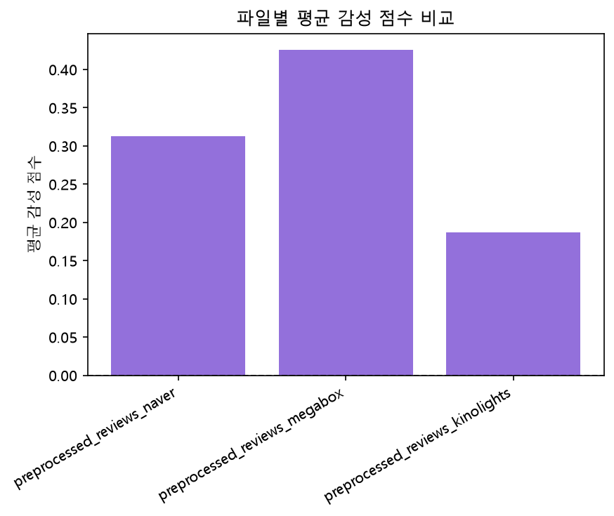

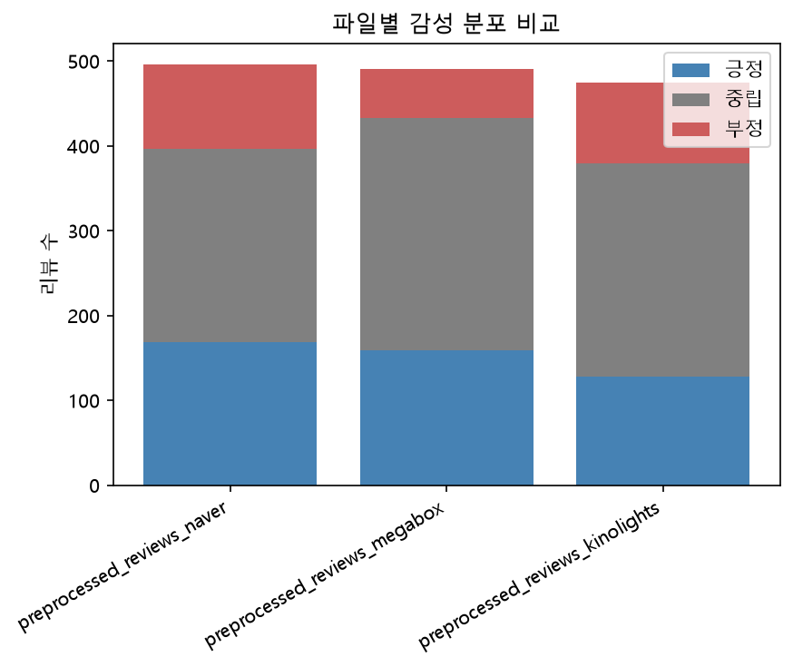

다음은 사이트 별 평균 감성 점수를 비교한 것이다. 평균 감성 점수는 megabox, naver, kinolights 순으로 높다. 또한 여기서 한가지 눈여겨볼 점은 중립 점수가 높다는 점이다. 세 곳 사이트 모두 중립이 가장 높으며, 긍정 비율은 naver가 가장 높고 megabox, kinolights 순으로 낮아진다. 부정 비율은 naver와 kinolights가 비슷하게 가장 높고, megabox가 가장 낮다.
megabox

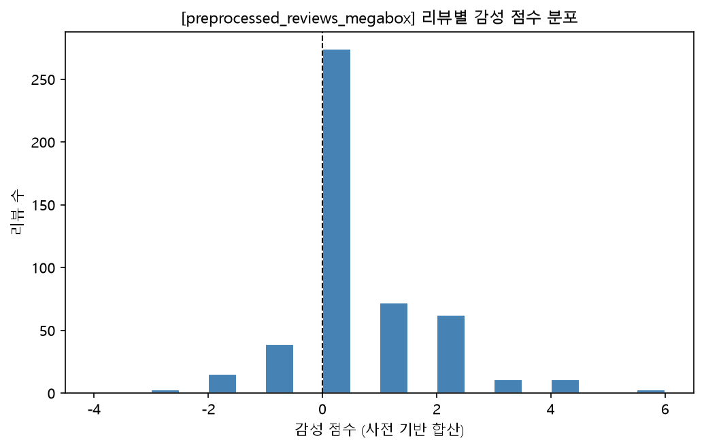

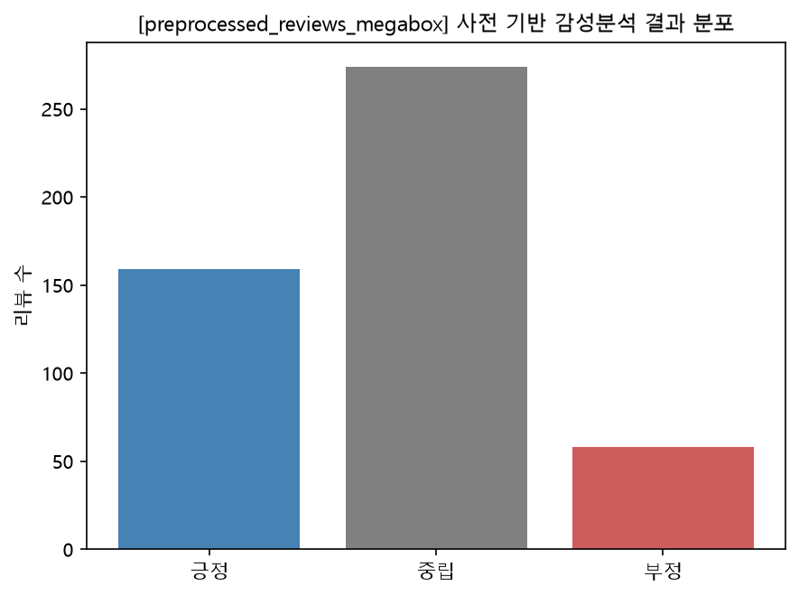

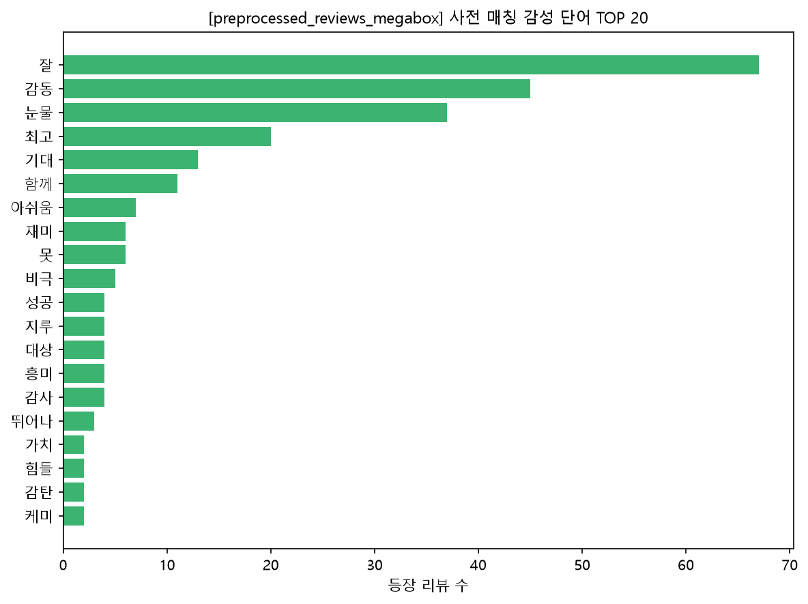

사이트별 특징을 보면 다음과 같다. megabox의 리뷰별 감성 점수 분포를 보면 0이 가장 많고 다음으로 긍정인 오른쪽으로 살짝 퍼져있다. 이는 대체로 긍정적인 리뷰라고 볼 수 있으며, 0에 몰린 것이 중립적인 리뷰가 많다기 보단, 사전에 매칭되는 단어가 적다고 볼 수 있다. 리뷰 내용을 살펴보았을 때, "단종"이나 "유해진", "박지훈" 등과 같은 배역, 배우 이름이 많이 보인 것을 근거로 들 수 있다. megabox는 긍정적인 리뷰 수가 비교적 많은 것으로 볼 수 있으며 영화에 대한 칭찬, 감동적인 영화라는 리뷰가 많이 쓰여진 것으로 분석할 수 있다.

kinolights

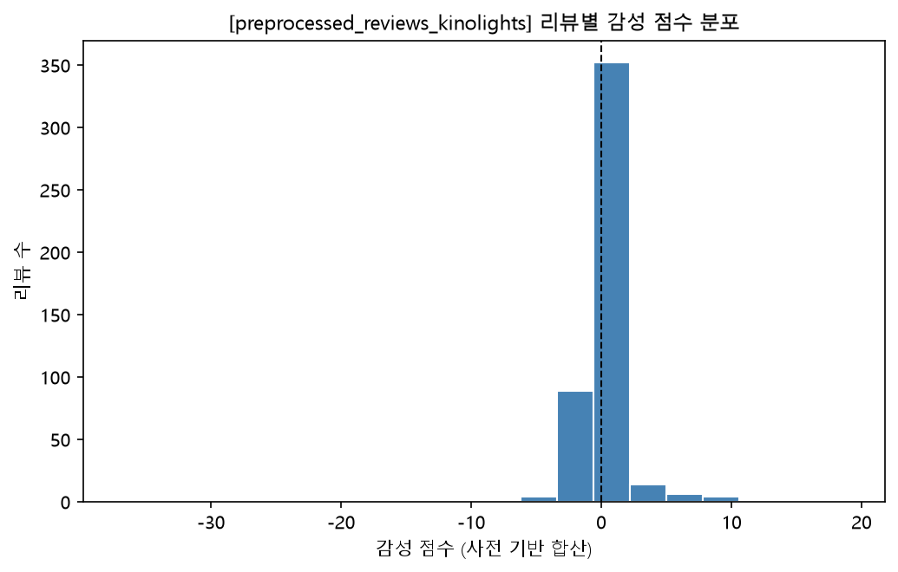

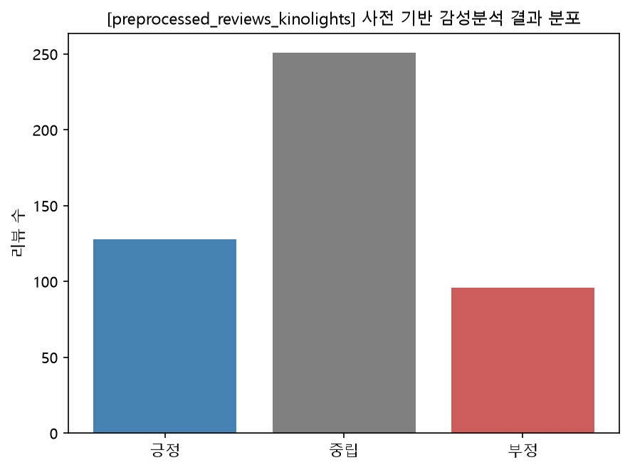

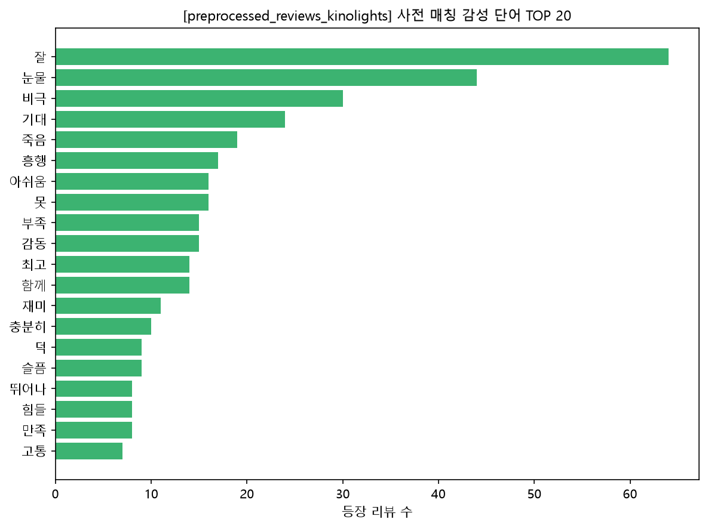

kinolights는 마찬가지로 0이 가장 많지만, megabox와 반대로 왼쪽이 오른쪽보다 좀 더 출현빈도가 높다. 감성분석 결과 분포를 살펴보면, megabox보다 긍정 리뷰 수가 살짝 내려가고 부정 리뷰 수가 뚜렷하게 올라간 것을 살펴볼 수 있다. 사전 매칭 top20를 보면 이 차이가 극명하게 드러난다. megabox와 달라진 점은 비극, 죽음, 아쉬움 등의 단어가 고빈도로 등장한 것을 볼 수 있다. kinolights는 megabox나 naver에 비해 긍정적 리뷰 대비 부정적인 리뷰가 더 많다고 볼 수 있으며, 비극적인 줄거리에 대한 리뷰, 영화에 대한 아쉬움의 내용 등이 담겼을 것으로 분석할 수 있다.

naver

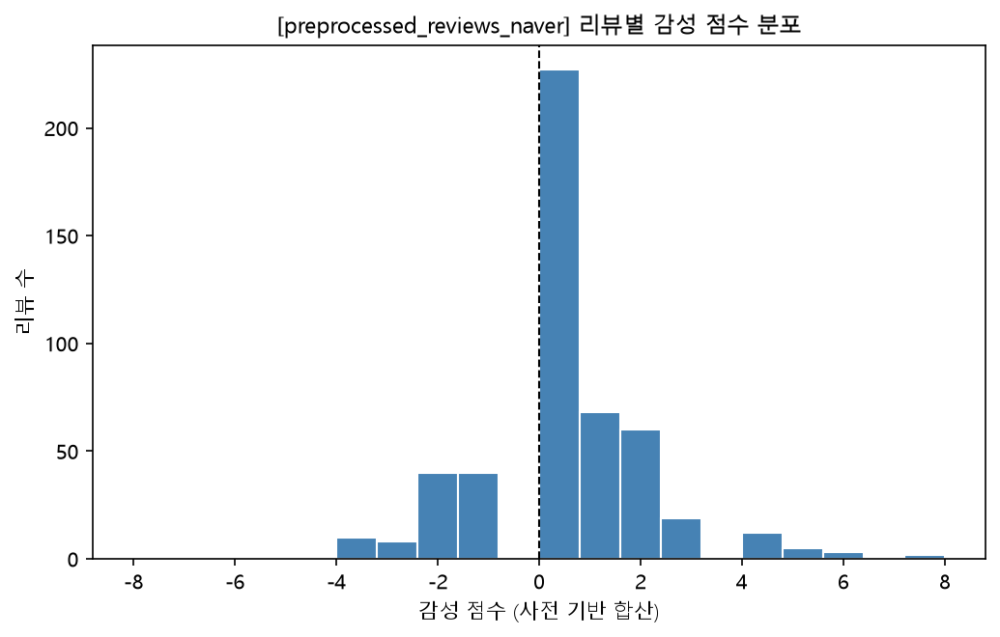

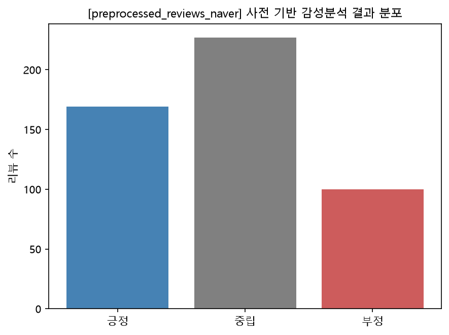

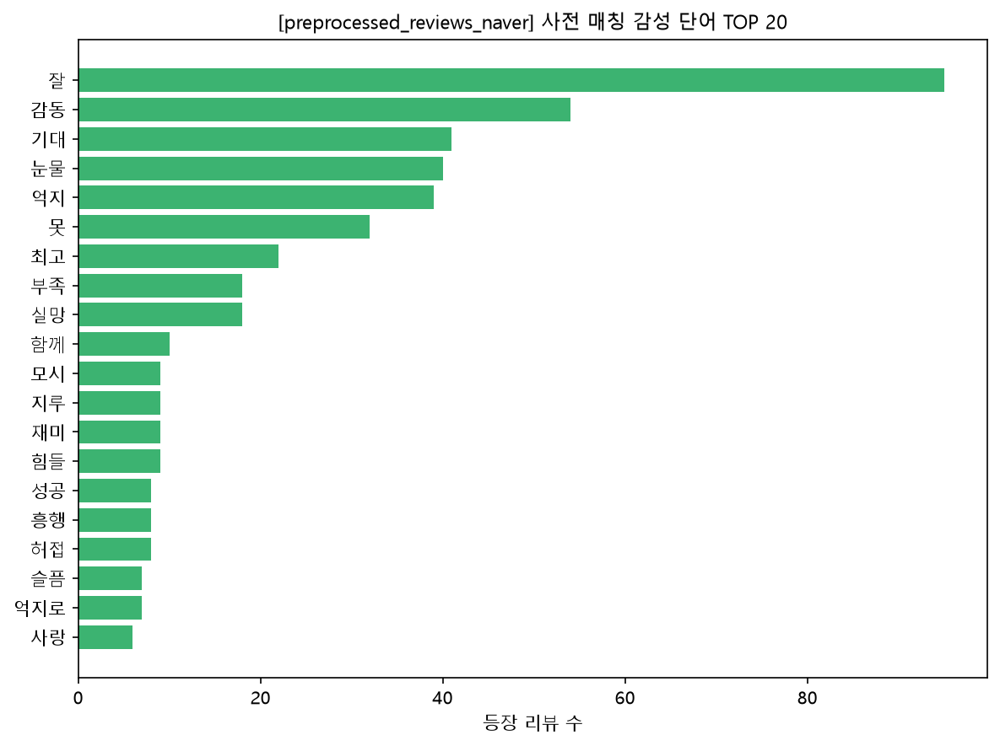

naver 리뷰는 megabox와 kinolights의 사이에 위치하고 있다. naver와 kinolights의 부정 리뷰 수는 비슷하고(약 20%), naver의 긍정 리뷰 수는 megabox보다 조금 더 많은 것으로 확인된다. 즉 다른 사이트들에 비해 중립 리뷰 수가 적다. 분포를 확인했을 때 이 현상은 두드러지게 드러난다. 마찬가지로 0점이 제일 높지만, 앞의 두 사이트와 다르게 오른쪽, 왼쪽 모두 비교적 고르게 퍼져있음을 확인할 수 있다. 오른쪽이 왼쪽보다 좀 더 많은 리뷰 수를 가지고 더 고르게 퍼져있지만, 앞에 두 사이트에 비하면 비교적 양 방향으로 고르게 퍼져있다. 고빈도 단어를 확인했을 때, megabox와 같이 감동, 눈물 등의 단어가 고빈도를 보이고 동시에 억지와 같은 부정적 단어도 확인할 수 있었다. 잘, 눈물, 기대는 세곳의 사이트 모두 고빈도를 나타낸 단어이다. naver는 중립을 나타내는 리뷰가 두 사이트에 비해 다소 적으며 긍정, 부정이 좀 더 양극화 되어 나타났다고 볼 수 있다.

전체적으로는 잘, 눈물, 기대의 단어를 통해 기대받던 영화이고 눈물을 자아내는 감동적인 영화임을 고빈도 텍스트를 통해 알 수 있었다. 중립의 리뷰가 많은 이유는 위에서 언급한 것 처럼, 중립적인 리뷰가 많다는 해석보다는 사전에 잡히지 않는 단어가 많다고 분석할 수 있다. 이는 리뷰 내용을 살펴보았을 때 "단종", "유해진", "박지훈" 등과 같은 영화 속 배역과 해당 배우에 대한 주목도가 높았던 것을 근거로 들 수 있을 것이다.

### 시계열 분석: 사이트별 평점 및 리뷰 개수 추이

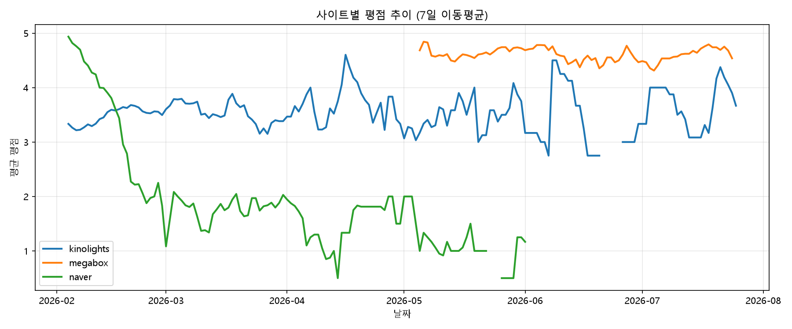
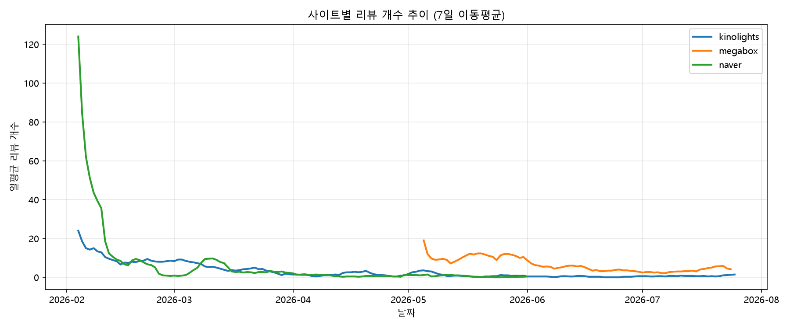

**분석 방법**
- 각 사이트의 일별 평균 평점 및 일별 리뷰 개수를 계산한 뒤, 리뷰 유입이 없는 날의 노이즈를 완화하기 위해 7일 이동평균(rolling mean)을 적용해 추이를 시각화함
- 세 사이트(kinolights, megabox, naver)의 크롤링 시점이 서로 달라 전체 기간(2026-02-04/~2026-07-25)을 기준으로 겹쳐서 비교함

**주요 발견**
1. **naver**: 개봉 초반(2월) 평점이 5점에 가깝게 높게 형성되었다가, 시간이 지나며 꾸준히 하락해 1점대까지 떨어지는 뚜렷한 하락 추세를 보임. 동시에 리뷰 개수도 초반 하루 100개 이상 폭발적으로 몰렸다가 이후 급격히 감소함 — 개봉 직후 기대감 섞인 리뷰가 대거 유입되고, 이후 냉정한 평가로 전환된 것으로 추정됨
2. **megabox**: 관측 기간(5/~7월) 내내 평점이 4.3/~4.8 사이로 안정적으로 유지됨.
실관람객 인증 기반 리뷰 시스템의 영향으로 추정되며, 리뷰 개수도 하루 5/~20개 수준으로 꾸준히 유입됨
3. **kinolights**: 3/~4점대에서 뚜렷한 추세 없이 등락을 반복함. 리뷰 개수 자체가 적어(하루 1/~5개) 이동평균으로도 노이즈가 다소 남아있음

**시사점**: 동일 영화(&lt;왕과 사는 남자&gt;)에 대한 평가라도, 플랫폼의 리뷰 작성 방식(실관람객 인증 여부, 리뷰 유입 시점)에 따라 평점 추이 패턴이 뚜렷하게 달라짐을 확인함