# YBIGTA_newbie_team_project

## 팀 소개
안녕하세요 YBIGTA 신입기수 세션 6조입니다.

## 팀원 자기소개
- **권준범**: 응용정보공학과 23학번, 04년생
- **나예린**: 도시공학과 24학번, 05년생
- **박형민**: 문헌정보학과, 26학번, 01년생

## GitHub 협업 과정 (4회차)

### Branch Protection Rule 적용


### Main 브랜치 Push 거부 확인


### PR + Review + Merge


## 과제 실행 방법

### 1. Web
FastAPI와 MVC 패턴을 기반으로 사용자 로그인 기능 구현

- **index.html 꾸미기**: 다크모드 스타일링 등 시각적 요소 추가
- **user_service.py**: 로그인, 회원가입, 삭제, 비밀번호 변경에 대한 비즈니스 로직과 예외 처리 구현
- **user_router.py**: 아래 4개 API 엔드포인트 구현
  - `POST /api/user/login` - 로그인
  - `POST /api/user/register` - 회원가입
  - `DELETE /api/user/delete` - 회원 삭제
  - `PUT /api/user/update-password` - 비밀번호 변경

### 2. 크롤링
<왕과 사는 남자> 영화에 대해 세 개 사이트에서 리뷰 데이터 수집

- **메가박스**: 별점(10점 만점), 작성일, 리뷰 내용 510개 수집, `database/reviews_megabox.csv`에 저장
- **Kinolights**: 별점(5점 만점), 작성일, 리뷰 내용 505개 수집, `database/reviews_kinolights.csv`에 저장
- **네이버 영화 관람평**: 별점(5점 만점), 작성일, 리뷰 내용 500개 수집, `database/reviews_naver.csv`에 저장
- 리뷰 내용이 비어있는 관람평은 최소조건(별점/날짜/내용 모두 포함) 충족을 위해 수집에서 제외

### 3. EDA·FE
크롤링한 세 사이트의 리뷰 데이터를 대상으로 개별 분석과 사이트간 비교분석 진행

- **EDA**: 별점, 텍스트 길이, 날짜의 분포와 이상치 파악
- **데이터 전처리/FE**: 사이트별 별점·날짜 형식 통일, 결측치·이상치 제거, 텍스트 전처리 진행, 파생변수로 요일 추출, TF-IDF 평균 점수 두 가지 생성
- **비교분석**: 감성분석, 키워드 분석, 시계열 분석을 통해 사이트간 차이 비교

---

# [3회차] 크롤링 과제 - &lt;왕과 사는 남자&gt; 리뷰 수집

## 데이터 소개

### 메가박스 (나예린)

- **사이트 링크**: https://www.megabox.co.kr/movie-detail/comment?rpstMovieNo=25104500
- **데이터 형식**: `rating`(별점, 10점 만점), `date`(작성일, YYYY-MM-DD), `content`(리뷰 내용)
- **수집 개수**: 510개
- **저장 위치**: `database/reviews_megabox.csv`
- **비고**: 리뷰 내용이 비어있는 관람평(별점만 남긴 경우)은 최소조건(별점/날짜/내용 모두 포함)을 만족시키기 위해 수집에서 제외했습니다.

### Kinolights (권준범)

- **사이트 링크**: https://m.kinolights.com/season/148606/reviews
- **데이터 형식**: `rating`(별점, 5점 만점), `date`(작성일, YYYY-MM-DD), `content`(리뷰 내용)
- **수집 개수**: 505개
- **저장 위치**: `database/reviews_kinolights`
- **비고**: 리뷰 내용이 비어있는 관람평(별점만 남긴 경우)은 최소조건(별점/날짜/내용 모두 포함)을 만족시키기 위해 수집에서 제외했습니다.


### 네이버 영화 관람평 (박형민)

- **사이트 링크**: https://search.naver.com/search.naver?where=nexearch&sm=tab_etc&mra=bkEw&pkid=68&os=35442190&qvt=0&query=%EC%99%95%EA%B3%BC%20%EC%82%AC%EB%8A%94%20%EB%82%A8%EC%9E%90%20%EA%B4%80%EB%9E%8C%ED%8F%89
- **데이터 형식**: `rating`(별점, 5점 만점), `date`(작성일, YYYY-MM-DD HH:MM:SS AM/PM), `content`(리뷰 내용)
- **수집 개수**: 500
- **저장 위치**: `database/reviews_naver.csv`

## 실행 방법

### 0. 필요한 패키지 설치

```bash
pip install beautifulsoup4 selenium pandas scikit-learn kiwipiepy matplotlib seaborn --break-system-packages
```

### 1. 전체 크롤러 한 번에 실행

프로젝트 루트(`README.md`가 있는 위치)에서 아래 명령어 실행 시,
`CRAWLER_CLASSES`에 등록된 모든 크롤러가 순서대로 실행되어
각자의 결과 CSV가 지정한 output_path에 저장됨

```bash
python -m review_analysis.crawling.main -o {output_path} --all
```

예시:

```bash
python -m review_analysis.crawling.main -o database --all
```

### 2. 특정 크롤러 하나만 실행

```bash
python -m review_analysis.crawling.main -o database --crawler megabox
```

예시 (메가박스만 실행):

```bash
python -m review_analysis.crawling.main -o {output_path} --crawler {크롤러 이름}
```

`{크롤러 이름}`에는 `review_analysis/crawling/main.py`의 `CRAWLER_CLASSES` 딕셔너리에 
등록된 이름(`kinolights`, `megabox` 등) 사용

### 3. 브라우저 창 실행 안내

Selenium이 Edge, Chrome 브라우저를 직접 실행하여 크롤링 진행
실행 중 브라우저 창 유지 필수(임의 종료 금지)
크롤링 종료 시 브라우저 자동 종료

---

# [4회차] EDA&FE, 시각화 과제 - &lt;왕과 사는 남자&gt; 리뷰 분석

## 1. EDA

### 이상치와 결측치


사이트 별 행 개수와 결측치


사이트 별 평점 분포(이상치 탐색)


각 사이트가 조건에 맡게 500개 이상씩 리뷰가 잘 수집된 것으로 보인다. 또한 수집한 평점, 날짜, 리뷰 내용도 수집과정에서 결측값 없이 잘 수정된 것으로 보인다. 날짜의 경우 YYYY-MM-DD로 수집되었고 naver의 경우는 시간까지 수집되었다(HH:MM:SS AM/PM). 리뷰 내용도 이상치로 볼 수 있는 내용은 없었다. 평점의 경우 확인해볼 점은 평점의 척도였다. megabox의 경우 평점이 10점 만점이지만, naver와 kinolights는 5점 만점으로 수집되었다(naver의 평점 척도도 실은 10점 만점이었으나 수집과정에서 가장 평균적인 5점 척도로 환산하여 저장함). 결과적으로 처리해야할 결측값은 보이지 않으며, naver의 날짜 형식과 megabox의 평점 척도는 전처리가 필요할 것으로 보인다.

## 2. 전처리/FE

전처리 실행코드: python -m review_analysis.preprocessing.main -o database --all

전처리/FE를 진행하였다. 수집한 새 개의 사이트 모두 평점, 날짜, 리뷰 내용을 수집하였고 형식 상 큰 차이를 보이지 않아 팀원들과 상의 후 하나의 전처리 코드로 3개의 크롤링 데이터 전처리를 진행하였다.
먼저  EDA 과정에서 발견된 naver의 날짜 형식과 megabox의 평점 척도에 대해 전처리를 진행하였다. 날짜 형식은 시간을 제외한 YYYY-MM-DD 형식으로 통일하였고 평점 척도 또한 다른 사이트와 동일하게 5점 척도로 변환하였다. 추가적으로 리뷰 내용에 대해 텍스트 데이터 전처리를 진행하였다. 전처리는 java 등 다른 것이 별도로 필요없는 kiwipiepy를 활용해 형태소 분석을 진행하였다. kiwipiepy를 통해 리뷰 내용을 형태소 단위로 분해하고 코드에서 정의한 간단한 stopword 목록을 이용해 불용어를 제거하여 cleaned_review라는 컬럼에 텍스트 데이터 전처리 결과를 저장하였다. 추가적으로 전처리/FE 단계에서 2가지 파생변수를 생성하였는데 한 가지는 day_of_week로 날짜 정보를 통해 요일 정보를 파생 데이터로 가공하였다. 날짜 뿐 아니라 요일의 관점도 고려해 볼 수 있을 것 같다는 의견으로 가공되었다. 다른 하나는 tf_idf_mean_score이다. 이는 전처리한 텍스트 데이터를 이용해 TF-IDF 벡터화를 진행하여 리뷰당 평균 TF-IDF 값을 명시한 칼럼이다. 이는 텍스트 분석시 의미있는 지표이며 이를 통해 리뷰 내용들 중 주요한 키워드를 가진 리뷰를 간단히 살펴볼 수 있을 것 같다는 의견으로 가공된 데이터이다.

## 3. 비교분석

### 키워드 분석: 사이트별 리뷰에서 자주 언급되는 키워드 및 요소 비교


**분석 방법**
형태소 분석기 Kiwi로 리뷰 텍스트에서 명사만 추출했다. (감정어/형용사는 감정분석과 역할이 겹쳐 의도적으로 제외)
영화 제목과 "정도", "생각"과 같은 정보량이 없는 필러 명사는 불용어로 제거했다.
분석 1: 사이트별 상위 15개 명사 빈도 비교
분석 2: 실제 상위 빈도 결과를 바탕으로 배우 및 연기 / 연기 및 연출 / 감상 및 감정 이렇게 3개 카테고리 키워드 사전을 구성, 각 리뷰가 카테고리별 키워드를 1개 이상 포함하는지 여부로 언급 비율을 사이트별로 산출

**주요 발견**
공통 주요 키워드: 세 사이트 모두 "연기", "단종", "배우" 등이 상위권에 공통 등장 > 플랫폼과 무관하게 이 영화의 화제성이 결국 배우의 연기력과 역사적 소재에서 나온다는 근거가 됨.

세 사이트 모두 배우 및 연기 카테고리가 최상위 카테고리였다. (kinolights 49.1%, megabox 32.6%, naver 59.2%)

메가박스만 연출 및 스토리 언급이 13.6%로 독보적으로 낮음. (다른 두 사이트는 32-36%) > 메가박스에는 짧고 표면적인 감상을 위주로 하는 유저가 대다수이다.

네이버는 세 카테고리 전부 1위 (배우 및 연기 59.2%, 연출 및 스토리 36.5%, 감상 및 감정 37.8%) > 가장 다면적이고 풍부한 리뷰층을 확보한 사이트이다.

kinolights에서는 "기록", "장항준(감독)", "감정"과 같은 다른 사이트에는 잘 보이지 않는 단어가 상위권에 존재함 > 타 플랫폼보다 더 비평적이며 분석적인 리뷰 경향을 가짐

**시사점**
플랫폼의 성격이 리뷰의 내용을 결정한다: 단순 평점 분포뿐만 아니라 실제로 어떤 단어를 사용하는지까지 플랫폼별로 체계적으로 다르다는 것을 확인함.

실관람 인증 기반 (메가박스): 즉흥적/표면적 반응 | 접근성 넓은 대중 플랫폼 (네이버): 다면적 리뷰 | 마니아 성향 앱 (kinolights): 분석적/비평적 리뷰라는 일관적 패턴이 형성됨

### 감성분석: 사이트별 리뷰 내용의 긍정/부정 반응 분석


다음은 사이트 별 평균 감성 점수를 비교한 것이다. 평균 감성 점수는 megabox, naver, kinolights 순으로 높다. 또한 여기서 한가지 눈여겨볼 점은 중립 점수가 높다는 점이다. 세 곳 사이트 모두 중립이 가장 높으며, 긍정 비율은 naver가 가장 높고 megabox, kinolights 순으로 낮아진다. 부정 비율은 naver와 kinolights가 비슷하게 가장 높고, megabox가 가장 낮다.
megabox


사이트별 특징을 보면 다음과 같다. megabox의 리뷰별 감성 점수 분포를 보면 0이 가장 많고 다음으로 긍정인 오른쪽으로 살짝 퍼져있다. 이는 대체로 긍정적인 리뷰라고 볼 수 있으며, 0에 몰린 것이 중립적인 리뷰가 많다기 보단, 사전에 매칭되는 단어가 적다고 볼 수 있다. 리뷰 내용을 살펴보았을 때, "단종"이나 "유해진", "박지훈" 등과 같은 배역, 배우 이름이 많이 보인 것을 근거로 들 수 있다. megabox는 긍정적인 리뷰 수가 비교적 많은 것으로 볼 수 있으며 영화에 대한 칭찬, 감동적인 영화라는 리뷰가 많이 쓰여진 것으로 분석할 수 있다.

kinolights


kinolights는 마찬가지로 0이 가장 많지만, megabox와 반대로 왼쪽이 오른쪽보다 좀 더 출현빈도가 높다. 감성분석 결과 분포를 살펴보면, megabox보다 긍정 리뷰 수가 살짝 내려가고 부정 리뷰 수가 뚜렷하게 올라간 것을 살펴볼 수 있다. 사전 매칭 top20를 보면 이 차이가 극명하게 드러난다. megabox와 달라진 점은 비극, 죽음, 아쉬움 등의 단어가 고빈도로 등장한 것을 볼 수 있다. kinolights는 megabox나 naver에 비해 긍정적 리뷰 대비 부정적인 리뷰가 더 많다고 볼 수 있으며, 비극적인 줄거리에 대한 리뷰, 영화에 대한 아쉬움의 내용 등이 담겼을 것으로 분석할 수 있다.

naver


naver 리뷰는 megabox와 kinolights의 사이에 위치하고 있다. naver와 kinolights의 부정 리뷰 수는 비슷하고(약 20%), naver의 긍정 리뷰 수는 megabox보다 조금 더 많은 것으로 확인된다. 즉 다른 사이트들에 비해 중립 리뷰 수가 적다. 분포를 확인했을 때 이 현상은 두드러지게 드러난다. 마찬가지로 0점이 제일 높지만, 앞의 두 사이트와 다르게 오른쪽, 왼쪽 모두 비교적 고르게 퍼져있음을 확인할 수 있다. 오른쪽이 왼쪽보다 좀 더 많은 리뷰 수를 가지고 더 고르게 퍼져있지만, 앞에 두 사이트에 비하면 비교적 양 방향으로 고르게 퍼져있다. 고빈도 단어를 확인했을 때, megabox와 같이 감동, 눈물 등의 단어가 고빈도를 보이고 동시에 억지와 같은 부정적 단어도 확인할 수 있었다. 잘, 눈물, 기대는 세곳의 사이트 모두 고빈도를 나타낸 단어이다. naver는 중립을 나타내는 리뷰가 두 사이트에 비해 다소 적으며 긍정, 부정이 좀 더 양극화 되어 나타났다고 볼 수 있다.

전체적으로는 잘, 눈물, 기대의 단어를 통해 기대받던 영화이고 눈물을 자아내는 감동적인 영화임을 고빈도 텍스트를 통해 알 수 있었다. 중립의 리뷰가 많은 이유는 위에서 언급한 것 처럼, 중립적인 리뷰가 많다는 해석보다는 사전에 잡히지 않는 단어가 많다고 분석할 수 있다. 이는 리뷰 내용을 살펴보았을 때 "단종", "유해진", "박지훈" 등과 같은 영화 속 배역과 해당 배우에 대한 주목도가 높았던 것을 근거로 들 수 있을 것이다.

### 시계열 분석: 사이트별 평점 및 리뷰 개수 추이


**분석 방법**
- 각 사이트의 일별 평균 평점 및 일별 리뷰 개수를 계산한 뒤, 리뷰 유입이 없는 날의 노이즈를 완화하기 위해 7일 이동평균(rolling mean)을 적용해 추이를 시각화함
- 세 사이트(kinolights, megabox, naver)의 크롤링 시점이 서로 달라 전체 기간(2026-02-04/~2026-07-25)을 기준으로 겹쳐서 비교함

**주요 발견**
1. **naver**: 개봉 초반(2월) 평점이 5점에 가깝게 높게 형성되었다가, 시간이 지나며 꾸준히 하락해 1점대까지 떨어지는 뚜렷한 하락 추세를 보임. 동시에 리뷰 개수도 초반 하루 100개 이상 폭발적으로 몰렸다가 이후 급격히 감소함 — 개봉 직후 기대감 섞인 리뷰가 대거 유입되고, 이후 냉정한 평가로 전환된 것으로 추정됨
2. **megabox**: 관측 기간(5/~7월) 내내 평점이 4.3/~4.8 사이로 안정적으로 유지됨.
실관람객 인증 기반 리뷰 시스템의 영향으로 추정되며, 리뷰 개수도 하루 5/~20개 수준으로 꾸준히 유입됨
3. **kinolights**: 3/~4점대에서 뚜렷한 추세 없이 등락을 반복함. 리뷰 개수 자체가 적어(하루 1/~5개) 이동평균으로도 노이즈가 다소 남아있음

**시사점**: 동일 영화(&lt;왕과 사는 남자&gt;)에 대한 평가라도, 플랫폼의 리뷰 작성 방식(실관람객 인증 여부, 리뷰 유입 시점)에 따라 평점 추이 패턴이 뚜렷하게 달라짐을 확인함

### DB, Docker, AWS

**Docker hub 주소**
https://hub.docker.com/r/rexkwon/ybigta-app

**모든 API 실행 결과**

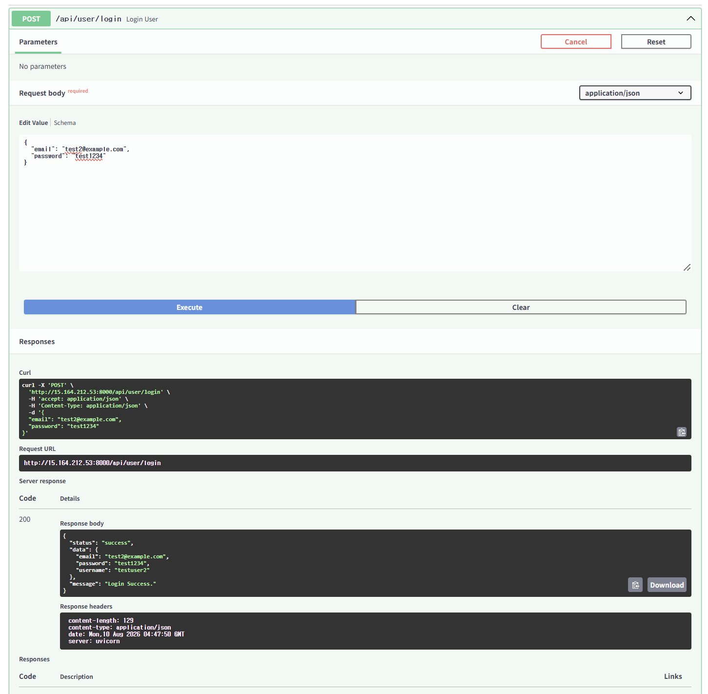

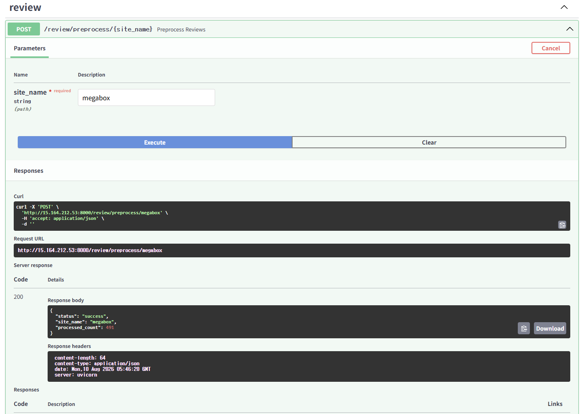

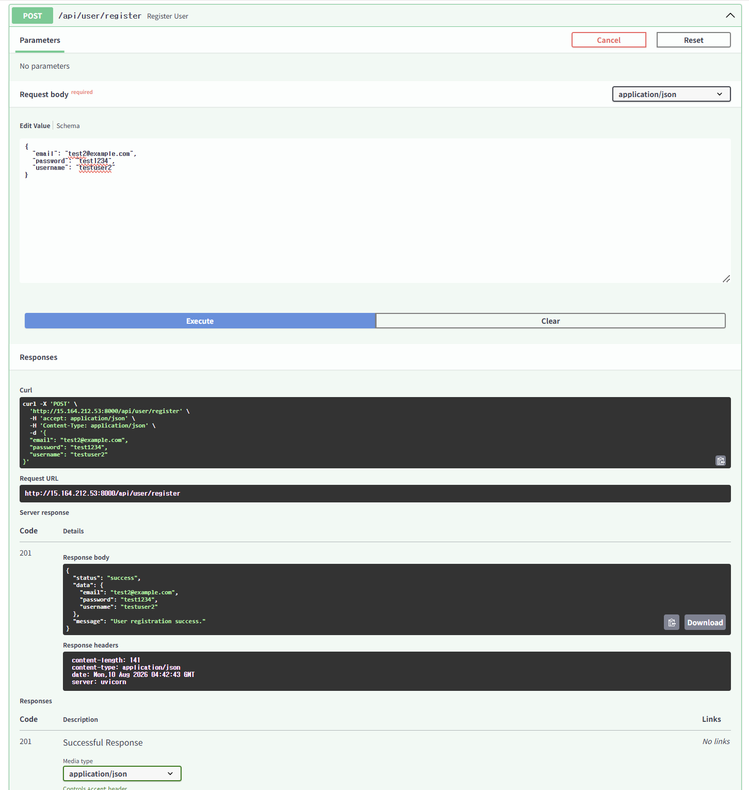

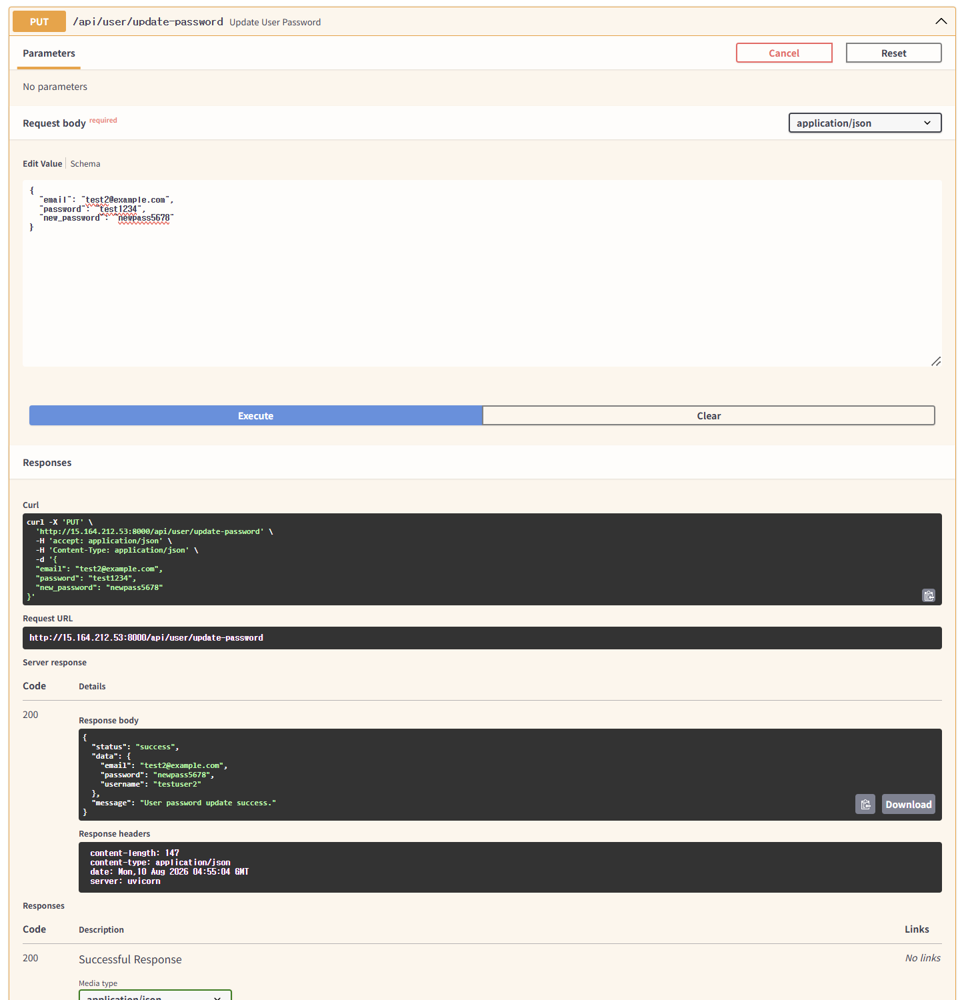

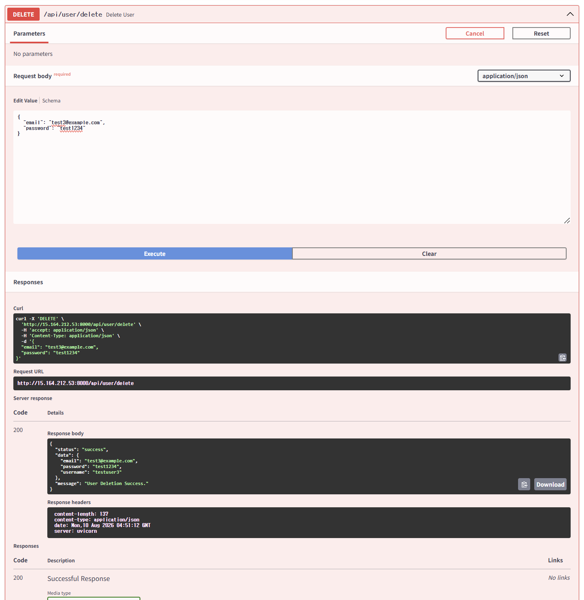

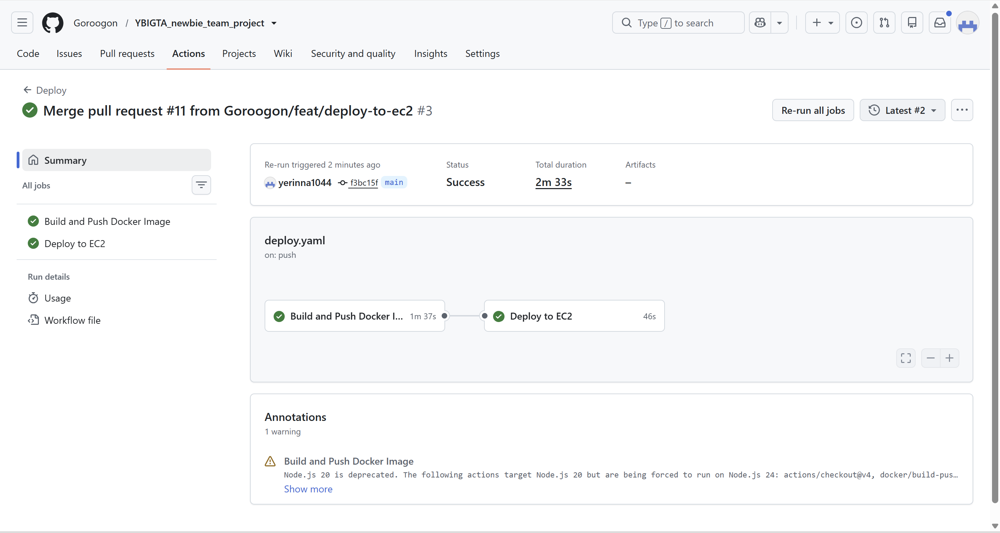

**프로젝트 진행 소감**
DB파트를 다루며 성격이 다른 두 데이터베이스를 함께 다뤄본 것이 인상 깊었습니다. MySQL은 유저 정보처럼 스키마가 명확한 데이터에, MongoDB는 크롤링 데이터처럼 구조가 자주 바뀌는 데이터에 적합하다는 걸 직접 체감할 수 있었습니다. MySQL 같은 관계형 데이터베이스는 테이블 구조와 컬럼 타입을 미리 정의해두고 데이터를 저장하는 반면, MongoDB 같은 NoSQL(문서형 데이터베이스)은 컬렉션마다 문서(document)의 형식이 고정되어 있지 않아 유연하게 데이터를 다룰 수 있습니다. 특히 MongoDB 전처리 API를 만들면서는 스키마가 고정되지 않은 만큼 필드명과 형식을 미리 약속해두지 않으면 데이터가 뒤죽박죽될 수 있다는 점도 배웠습니다.

Docker 부분을 진행하며 가장 놀라웠던 부분은 프로그램을 직접 다운로드하지 않아도 Docker 환경을 통해 필요한 실행 환경을 그대로 가져올 수 있다는 점이었습니다. Docker는 애플리케이션과 그 실행에 필요한 라이브러리, 설정을 하나의 이미지(image)로 패키징하고, 이를 컨테이너(container)라는 격리된 환경에서 실행하는 방식으로 동작합니다. 작업 환경이 달라지거나 버전이 달라졌을 때, 이전에는 잘 구동되던 코드가 갑자기 작동하지 않는 경험을 종종 했었는데, 가상환경 외에도 Docker라는 방법을 새롭게 익힐 수 있어 유익했습니다. 특히 팀 프로젝트처럼 협업하는 상황에서는 Docker를 통해 서로의 작업 환경을 그대로 공유할 수 있어 훨씬 편리하다는 것을 느꼈습니다.

AWS를 처음 다루며 로컬에서만 돌리던 서버를 실제로 EC2 인스턴스에 올려 외부에서 접속 가능하게 만들어본 것도 새로운 경험이었습니다. 보안그룹(Security Group)은 인스턴스 단위로 적용되는 일종의 방화벽으로, 어떤 IP와 포트로 들어오는 트래픽을 허용할지 규칙으로 지정해줘야 합니다. 보안그룹에서 인바운드 규칙을 하나씩 열어주지 않으면 아무리 서버가 정상적으로 떠 있어도 외부에서 접근할 수 없다는 걸 알게 되면서, 클라우드에서는 서버를 켜는 것과 외부에서 접근 가능하게 만드는 것이 별개의 작업이라는 걸 이해하게 됐습니다. RDS로 MySQL을, Atlas로 MongoDB를 호스팅해보면서는 로컬 DB와 달리 네트워크 설정, 자격 증명 관리 등 신경 써야 할 요소가 훨씬 많다는 것도 느꼈습니다.

마지막으로 Github Actions으로 과제를 마무리하면서 CI/CD 파이프라인을 직접 구성해본 것도 새로운 경험이었습니다. CI/CD는 코드 변경사항을 자동으로 빌드·테스트하고(CI, 지속적 통합) 서버에 배포까지 이어주는(CD, 지속적 배포) 과정을 뜻하는데, 그동안은 코드를 수정할 때마다 이미지를 빌드하고, 푸시하고, 서버에 접속해 다시 pull받는 과정을 수작업으로 해왔던 이 흐름을 deploy.yaml 하나로 자동화할 수 있다는 게 신기했습니다. 특히 docker id, password, ec2 ip주소처럼 민감한 정보를 코드에 직접 적지 않고 Github Secrets로 분리해서 관리해야 한다는 걸 배우면서, 협업 환경에서는 편의성만큼이나 보안도 함께 고려해야 한다는 것을 다시 한번 깨달았습니다.

---

# YBIGTA Newbie Team Project — AI Agent

데이터 수집 → DB 자동 갱신 → MCP를 통한 데이터 조회 → Agent를 통한 분석까지
하나의 서비스로 연결한 프로젝트입니다.

---

## Architecture

```
External Data (megabox 리뷰)
        │ 자동 수집
        ▼
AWS Collector (EC2, cron)
        │ 데이터 저장
        ▼
┌─────────────────────────────────────────┐
│ AWS VPC                                  │
│                                           │
│  Public Subnet                           │
│  ┌─────────────────────────────────┐     │
│  │ MCP Server (EC2)                 │     │
│  │  Nginx(80/443, Bearer 인증)       │     │
│  │   └─ MCP App(:8000, 내부 전용)    │     │
│  └───────────────┬───────────────────┘     │
│                  │ Private Network         │
│  Private Subnet  │                         │
│  ┌───────────────▼─────────────────┐     │
│  │ RDS (coin_db / reviews)          │     │
│  │  Public Access: OFF               │     │
│  └───────────────────────────────────┘     │
└─────────────────────────────────────────┘
                  ▲
                  │ MCP Tool Call (SSE)
                  │
        ┌─────────┴─────────┐
        │ Vercel / Next.js   │
        │ Data Agent          │
        └─────────┬─────────┘
                  ▼
                사용자
```


> 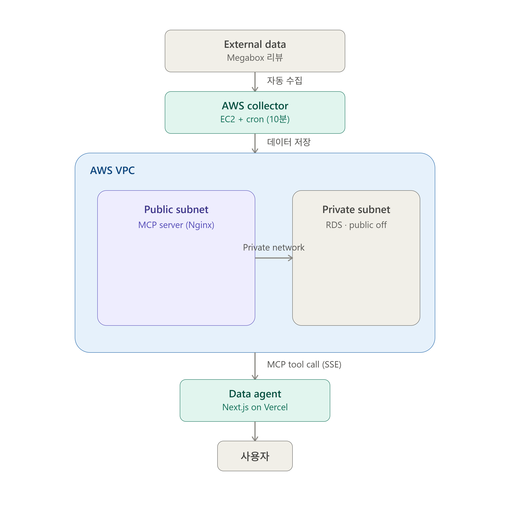

---

## Data Pipeline

- 어떤 데이터를 수집하는가: Megabox 영화 리뷰 데이터 (별점, 리뷰 내용, 작성일, 전처리된 리뷰, 요일, TF-IDF 평균 점수)
- 어떤 주기로 갱신되는가: 10분 간격 (사전에 수집·전처리된 리뷰 데이터를 배치 단위(20건씩)로 순환하며 DB에 반영)
- 어떤 AWS 기능을 사용했는가 (EC2 cron / EventBridge 등): EC2(collector 인스턴스, Public Subnet) + cron(주기적 자동 실행), RDS MySQL(Private Subnet, Public Access OFF), VPC(Public/Private Subnet 분리, 2개 가용 영역)
- DB Schema:

```sql
-- reviews 테이블
CREATE TABLE reviews (
    id BIGINT AUTO_INCREMENT PRIMARY KEY,
    site VARCHAR(50) NOT NULL,
    review_date DATE NOT NULL,
    rating FLOAT NOT NULL,
    content TEXT NOT NULL,
    cleaned_review TEXT,
    day_of_week VARCHAR(10),
    tf_idf_mean_score FLOAT,
    collected_at DATETIME NOT NULL,
    created_at DATETIME DEFAULT CURRENT_TIMESTAMP,
    updated_at DATETIME DEFAULT CURRENT_TIMESTAMP ON UPDATE CURRENT_TIMESTAMP,
    INDEX idx_site (site),
    INDEX idx_collected_at (collected_at)
);
```

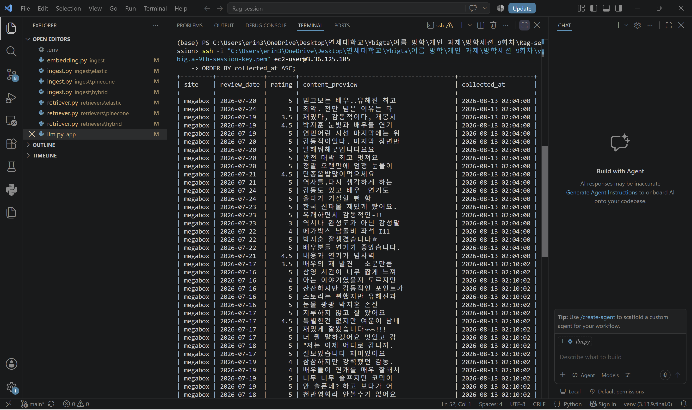

---

## MCP

### 어떤 Tool이 존재하는가 / 각 Tool은 무엇을 하는가

| Tool | 설명 | 파라미터 |
|---|---|---|
| `search_data` | 키워드/기간으로 리뷰 검색 | `keyword`, `start_date`, `end_date`, `limit` |
| `get_latest_data` | 가장 최근에 수집된 리뷰 데이터 조회 | `site` (megabox/naver/kinolights, 생략 시 전체), `limit` (기본 10, 최대 10~100) |
| `get_available_sites` | 조회 가능한 사이트 목록 확인 | 없음 |
| `aggregate_data` | 리뷰 데이터 집계/통계 (평균 평점 `avg_rating`, 리뷰 수 `review_count` 반환) | `site` (필수, megabox/naver/kinolights), `start_date` (필수, YYYY-MM-DD), `end_date` (필수, YYYY-MM-DD) |

### 왜 이러한 Tool 구조를 선택했는가

- Agent가 DB 전체를 가져가 LLM에게 분석을 맡기지 않고, **필요한 데이터만 MCP Tool로 선택적으로 조회**하도록 설계했습니다.
- Raw SQL을 그대로 실행하는 `execute_sql` 형태의 Tool은 만들지 않았습니다. 대신 각 Tool마다 허용 가능한 파라미터(keyword, date range, limit 등)를 명시적으로 제한하여 대량 조회·예상치 못한 쿼리를 방지했습니다.
- 조회 결과에는 `limit` 상한(기본 10, 최대 10~100)을 적용해 과도한 데이터 반환을 막았습니다.

### 코드 구조 (MCP Tool → Service → Repository)

```
mcp_server/
├── server.py          # FastMCP 인스턴스 생성 및 Tool 등록
├── tools/              # MCP Tool 정의 (search, latest, aggregation)
├── services/            # 비즈니스 로직
├── repositories/         # DB 접근 계층 (parameterized query)
├── Dockerfile
├── requirements.txt
└── .env.example
```

MCP Tool이 DB Connection과 SQL을 직접 다루지 않고 Service → Repository 계층을 거치도록 분리했습니다. 이렇게 하면 나중에 검색 백엔드를 MySQL에서 Elasticsearch/OpenSearch 등으로 교체하더라도 MCP Tool 자체는 그대로 두고 Repository 구현체만 교체할 수 있습니다.

### 새로운 데이터나 Tool을 추가하려면 어떻게 하면 되는가

1. `repositories/`에 새 데이터 소스에 대한 Repository 클래스 추가
2. `services/`에 해당 데이터를 다루는 Service 함수 추가
3. `tools/`에 새 Tool 함수를 만들고 `server.py`에서 `register()` 호출로 등록

---

## Security

### 왜 DB를 Private Subnet에 두었는가

RDS를 외부 인터넷에서 직접 접근하지 못하도록 하기 위함입니다. DB는 MCP 서버를 통해서만 조회되어야 하고, 그 외 경로(Vercel, 외부 클라이언트 등)에서 직접 접근할 수 없어야 하기 때문에 Private Subnet에 배치하고 `Publicly Accessible: No`로 설정했습니다.

### RDS Security Group은 어떻게 설정했는가

RDS 인바운드 규칙은 `0.0.0.0/0` 형태로 열지 않고, MCP 서버가 속한 보안그룹(`mcp-sg`)에서만 3306 포트로 접근 가능하도록 제한했습니다.

```
RDS Security Group Inbound
MySQL 3306   Source: mcp-sg
```

또한 DB 계정을 역할별로 분리했습니다:
- `mcp_user`: **read-only(SELECT)** 권한만 부여 — MCP 서버는 데이터 조회만 하면 되므로
- collector 쪽 계정은 별도로 INSERT/UPDATE 권한을 가짐 (A 담당 EC2)

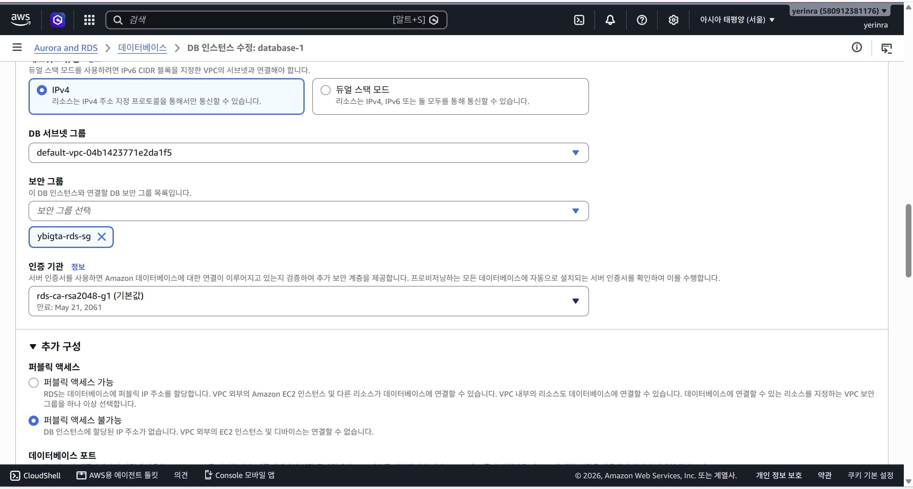
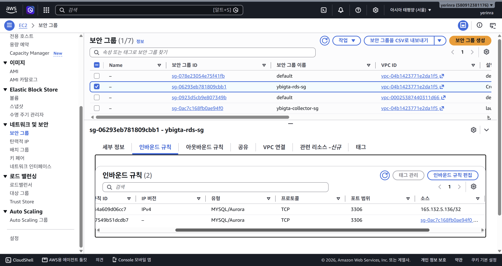

### MCP의 내부 API Port를 어떻게 보호했는가

MCP 애플리케이션은 내부적으로 8000번 포트에서 실행되지만, 이 포트를 인터넷에 직접 노출하지 않았습니다.

```
Internet → Nginx(80) → MCP(127.0.0.1:8000, 내부 전용)
```

- MCP 서버 컨테이너를 `docker run -p 127.0.0.1:8000:8000 ...` 형태로 실행하여, EC2 **내부에서만** 8000번 포트에 접근 가능하도록 바인딩했습니다.
- EC2의 mcp-sg 보안그룹 인바운드는 80/443(HTTP/HTTPS)과 22(SSH, 내 IP 한정)만 허용하고, 8000/3306 등 애플리케이션·DB 포트는 전혀 열지 않았습니다.

### MCP 인증은 어떻게 구현했는가

`mcp` 라이브러리(1.2.0) 버전이 ASGI 앱을 직접 노출하지 않아 애플리케이션 레벨 미들웨어 인증이 불가능했기 때문에, **Nginx 리버스 프록시 단에서 Bearer Token 인증**을 처리하도록 구현했습니다.

```nginx
map_hash_bucket_size 128;

map $http_authorization $auth_ok {
    "Bearer <MCP_AUTH_TOKEN>" 1;
    default 0;
}

server {
    listen 80;
    server_name _;

    location / {
        if ($auth_ok = 0) {
            return 401;
        }
        proxy_pass http://127.0.0.1:8000;
        proxy_set_header Host $host;
        proxy_buffering off;
        proxy_cache off;
        proxy_read_timeout 3600s;
    }
}
```

- 토큰 없이 요청 시 **401** 응답 확인 완료
- 유효한 토큰(`Authorization: Bearer <MCP_AUTH_TOKEN>`)으로 요청 시 정상 응답 확인 완료
- CORS 설정과는 별개로 서버 자체(Nginx)에서 인증을 검사하도록 구현하여, "CORS만으로는 인증이 아니다"라는 요건을 충족했습니다.

### 왜 Vercel Client에서 MCP를 직접 호출하지 않았는가

MCP 서버 주소와 인증 토큰이 브라우저(Client Bundle)에 노출되면 누구나 그 값을 가지고 MCP 서버에 직접 요청을 보낼 수 있게 됩니다. 이를 막기 위해 LLM 호출, MCP 인증 토큰 사용, MCP 서버 호출을 모두 Next.js의 **서버 사이드(Route Handler, `app/api/chat/route.ts`)** 에서만 수행하고, 브라우저(Client Component)는 사용자 입력과 채팅 UI 표시만 담당하도록 구조를 분리했습니다.

### API Key와 Token은 어디에서 관리하는가

- `mcp_server/.env` (EC2 로컬에만 존재, Git에 커밋되지 않음): `MYSQL_HOST`, `MYSQL_PORT`, `MYSQL_USER`, `MYSQL_PASSWORD`, `MYSQL_DB`, `MCP_AUTH_TOKEN`
- `.gitignore`, `.dockerignore` 양쪽 모두에 `.env`, `*.pem`을 등록하여 Git과 Docker 이미지 양쪽에서 credential이 노출되지 않도록 했습니다.
- Vercel 쪽 환경변수(`MCP_AUTH_TOKEN`, LLM API Key 등)는 `NEXT_PUBLIC_` 접두사를 사용하지 않고 서버 사이드 전용 환경변수로만 등록합니다. (담당: C)

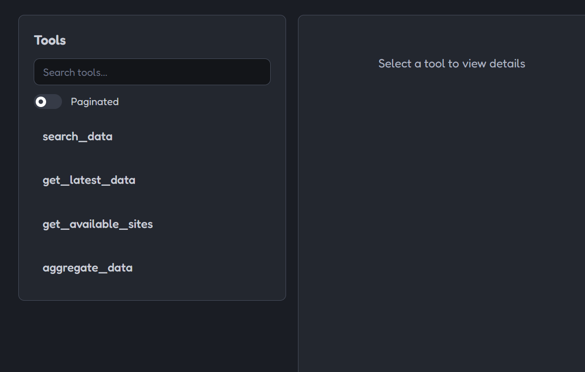 Tool 목록 조회
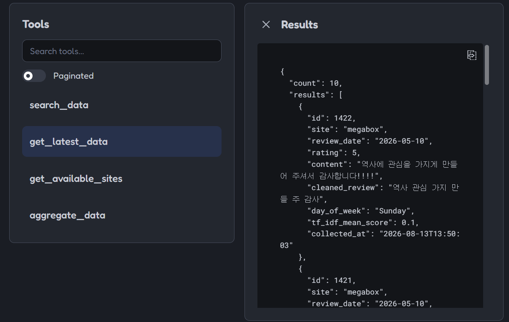 실제 Tool 호출 결과

---

## Agent

Next.js(App Router) + Vercel로 구현했습니다. `/api/chat` Route Handler(서버 사이드)에서 Anthropic Claude(tool use)로 필요한 MCP Tool을 선택·호출하고, 그 결과를 다시 LLM에 전달해 최종 답변을 생성합니다. LLM이 직접 SQL을 만들거나 DB/MCP 서버에 접근하는 경로는 없으며, 항상 `lib/mcp`(MCP 클라이언트)를 거쳐서만 데이터에 접근합니다.

**단순 조회 예시**
```
사용자 질문: 현재 가장 최근 데이터는 뭐야?
→ 호출된 MCP Tool: get_latest_data(limit=10)
→ 조회된 DB 데이터: megabox 사이트 리뷰 최신 10건 (collected_at 2026-08-13 14:50:02 동일 수집 배치, review_date 2026-07-10~07-14, 평점 3.5~5.0)
→ Agent 답변: 최신 리뷰 10건을 표로 정리해 제시하고, 전부 megabox 데이터이며 평점이 대체로 4.0~5.0으로 높다는 특징을 함께 요약
```

**분석/집계 예시**
```
사용자 질문: 최근 일주일 평균 평점과 그 이전 일주일 평균을 비교해줘.
→ 호출된 MCP Tool: aggregate_data(site="megabox", start_date, end_date) — 오늘(2026-08-13) 기준 "최근 1주"에는 실제 리뷰 데이터가 0건임을 먼저 확인하고, 데이터가 존재하는 가장 최근 구간(2026-07-08~07-14 vs 07-01~07-07)으로 기간을 재조정하여 총 10회 호출
→ 조회된 DB 데이터: 최근 구간(07-08~07-14) megabox 83건 평균 4.60점 / 이전 구간(07-01~07-07) megabox 45건 평균 4.47점
→ Agent 답변: 데이터가 없는 기간을 임의로 답하지 않고 그 사실을 먼저 안내한 뒤, 실제 데이터가 있는 구간 기준으로 "평균 평점 0.14점 상승, 리뷰 건수 약 2배 증가"로 분석. naver/kinolights는 DB에 데이터가 없어 비교에서 제외한다고 명시
```

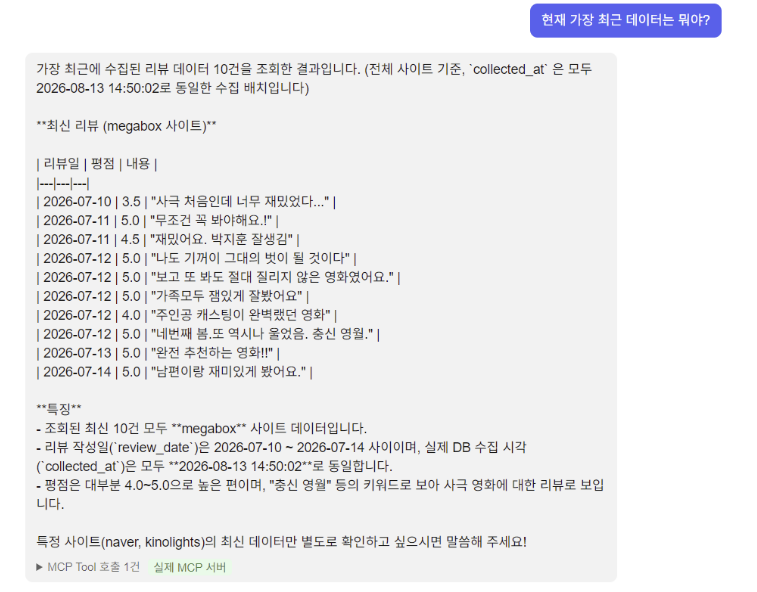
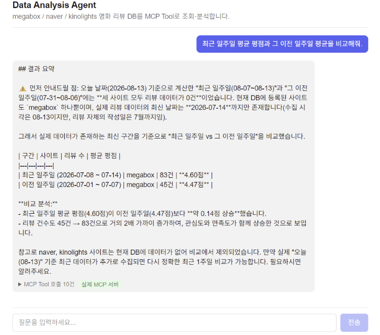

---

## 프로젝트 구조

```
YBIGTA_newbie_team_project/
├── collector/          # A 담당 — 데이터 수집
├── mcp_server/          # B 담당 — MCP 서버
│   ├── tools/
│   ├── services/
│   ├── repositories/
│   ├── server.py
│   ├── Dockerfile
│   └── requirements.txt
├── web/                 # C 담당 — Next.js Agent
│   ├── app/api/chat/route.ts
│   └── ...
├── aws/                  # 캡처 이미지 모음
├── .env.example
├── .gitignore
└── README.md
```

## 실행 방법

### MCP 서버 (Docker)

```bash
cd mcp_server
cp .env.example .env   # 실제 값 입력 후 사용
docker build -t mcp-server .
docker run -d --name mcp -p 127.0.0.1:8000:8000 --env-file .env mcp-server
```

Nginx가 80번 포트에서 리버스 프록시 + 인증을 처리하므로, 외부에서는 아래 형태로 접근합니다.

```bash
curl -H "Authorization: Bearer <MCP_AUTH_TOKEN>" http://<EC2 퍼블릭 IP>/sse
```

### MCP Tool 동작 확인 (MCP Inspector)

```bash
npx @modelcontextprotocol/inspector
```

- Transport: `sse`
- URL: `http://<EC2 퍼블릭 IP>/sse`
- Custom Header: `Authorization: Bearer <MCP_AUTH_TOKEN>`

### Data Analysis Agent (Next.js)

```bash
cd web
cp .env.example .env.local   # ANTHROPIC_API_KEY, MCP_SERVER_URL, MCP_AUTH_TOKEN 채우기
npm install
npm run dev
```

`http://localhost:3000` 접속 후 예시 질문을 입력하면 됩니다. `.env.local`의 `MCP_SERVER_URL`/`MCP_AUTH_TOKEN`이 비어있으면 자동으로 Mock 데이터(실제 MCP Tool 계약과 동일한 인터페이스)로 동작하므로, 서버가 아직 없을 때도 UI/Agent 로직 개발이 가능합니다.

---

## 주의사항 체크리스트

- [x] DB Port를 `0.0.0.0/0`으로 공개하지 않음
- [x] MCP에서 Raw SQL 실행 Tool을 제공하지 않음
- [x] MCP가 접근할 수 있는 데이터와 쿼리 범위를 제한함 (limit, 허용 파라미터)
- [x] DB는 Read-only Credential(`mcp_user`) 사용
- [x] MCP 내부 Port(8000)를 인터넷에 직접 노출하지 않음
- [x] API Key, MCP Token, DB Credential을 코드나 Client Bundle에 포함하지 않음
- [x] 새로운 데이터 소스나 Tool을 추가할 수 있도록 계층 구조로 확장 가능하게 설계
- [x] (C) Vercel Client에서 MCP를 직접 호출하지 않고 서버 사이드에서만 처리 — 구현 후 체크
